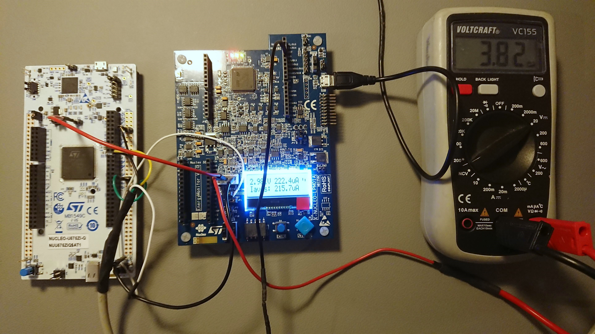

# Overview
This repository contains an example implementation of FreeRTOS in tickless idle mode 2 on a STM32U575 MCU. It utilizes the tickless idle mode in combination with the MCU STOP modes to dramatically decrease the MCU power consumption. Entering and exiting STOP modes is performed by the scheduler if the system is in idle. Therefore the NULCEO-U575ZI-Q Discovery Board is used.

The implementation uses the work of Jeff Tenney "FreeRTOS Tick/Tickless via LPTIM". The Repos can be found here:
- https://github.com/jefftenney/LPTIM-Tick-U5
- https://github.com/jefftenney/LPTIM-Tick
- https://gist.github.com/jefftenney/02b313fe649a14b4c75237f925872d72

Further info:
- https://www.freertos.org/low-power-tickless-rtos.html


# Build Environment

- STM32CubeIDE v1.10.1
- MCU Firmware Package STM32Cube FW_U5_V1.1.1
- FreeRTOS Kernel V10.4.6
- X-NUCLEO-LPM01A FW version 1.0.1
- STM32CubeMonitor-Power v1.1.1

The MCU Firmware Package does not support FreeRTOS auto generation in CubeMX. So i manually integrated the FreeRTOS Kernel into the Project from https://www.freertos.org/. Newer FW Packages (in newer CubeIDE versions) should support FreeRTOS autogeneration. But when i started the implementation on that project, only FW_U5_V1.1.1 was available.


# Power Consumption
For all tests the Firmware runs a single Task to toggle the green onboard LED every 1s. The blue onboard LED indicates weather the MCU is awaken or sleeping (LED blue on -> MCU is awaken). The power consumption is measured with a X-NUCLEO-LPM01A and the STM32CubeMonitor-Power. Additionally a string is printed on uart1 on every LED toggle. That can be used to check the correct scheduler timing.


### Testsetup:
The NULCEO-U575ZI-Q board is powered from X-NUCLEO-LPM01A either via 3.3V pin or via J5 (IDD) pin.

From [STM32U5 Nucleo-144 board User Manual (UM2861 Rev 9)](https://www.st.com/resource/en/user_manual/um2861-stm32u5-nucleo144-board-mb1549-stmicroelectronics.pdf):

> In some situations, it is interesting to use an external 3.3 V source on the 3V3
input (CN8 pin 7 or CN11 pin 16), for instance in case the 3.3 V is provided by an extension board. When the
Nucleo-144 is powered with only a 3.3V source, the STLINK-V3E part is not powered, thus programming and
debugging are unavailable.
When using the 3V3 input, the STLINK-V3E part is not supplied.
For this configuration, it is recommended to remove SB1 to avoid backward voltage to 5 V through U10, and
remove JP2 to avoid STM32 MCU reset from the STLINK-V3E part.




### Measure board consumption (MCU + Peripherals)
To measure the complete power consumption of the NULCEO-U575ZI-Q board (MCU + Peripherals), the board is powered via 3.3V pin (SB1 removed, JP2 open). 


### Measure MCU consumption
To measure only the MCU consumption of the NULCEO-U575ZI-Q board, the board is powered via JP5 (IDD) pin 2 (JP5 open, SB1 closed, JP2 closed).


### Scheduler precision
To verify that the scheduler has no timedrift or unprecise tick count on LPTIM while sleeping, the timestamps of the uart printout can be evaluated. It should occur every 1s. To make sure there is no timedrift, LSE is used instead of LSI as LPTIM clock source. STM32 internal RC oscillator typically has a higher drift than an external quartz.

```
(23:33:02.974) Startup!
(23:33:02.989) Start LED Green Task.
(23:33:02.989) LED Green toggled.
(23:33:03.981) LED Green toggled.
(23:33:04.988) LED Green toggled.
(23:33:05.980) LED Green toggled.
(23:33:06.987) LED Green toggled.
(23:33:07.980) LED Green toggled.
(23:33:08.987) LED Green toggled.
```


# Datasheets

- [MCU Reference Manual (RM0456 Rev 5)](https://www.st.com/resource/en/reference_manual/rm0456-stm32u575585-armbased-32bit-mcus-stmicroelectronics.pdf)
- [MCU Datasheet (DS13737 Rev 10)](https://www.st.com/resource/en/datasheet/stm32u575ag.pdf)
- [STM32U5 Nucleo-144 board User Manual (UM2861 Rev 9)](https://www.st.com/resource/en/user_manual/um2861-stm32u5-nucleo144-board-mb1549-stmicroelectronics.pdf)
- [Power Supply Measure Board Manual (UM2243 Rev 2)](https://www.st.com/resource/en/user_manual/um2243-stm32-nucleo-expansion-board-for-power-consumption-measurement-stmicroelectronics.pdf)

